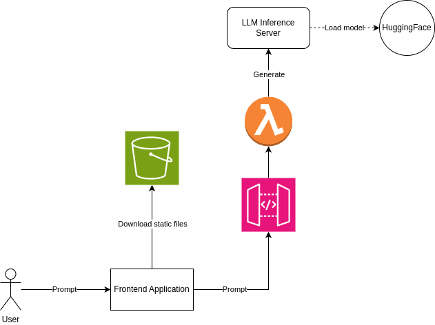

# OpenAI compatible API proxy running on AWS Lambda

This AWS Lambda handler acts as a proxy to call a Large Language Model.


## Architecture



The benefits of inserting a proxy between the frontend and the model inference service include

- Access control
- Throttling
- Logging
- Metrics
- Caching

It is a security requirement to distribute your Generative AI app without sharing your access token associated with your LLM provider of choice. After finetuning a base model with Lora, the merged model can be deployed to *replicate.com* or the adapter to *predibase.com*.

### Preferred option

The NodeJS handler runs on a Lambda *streaming* function. Lambda will still buffer response chunks before flushing them to the client. After testing, the intermediate buffering delay was not noticeable when summarizing a large PDF. The app was still reactive with live updates during the sequence generation.

### Alternatives considered

Introducing websockets or Server Side Events woud also provide instaneous feedback.

- Sending notifications to the websocket is possible when running a Lambda function through REST. This would require adding another API Gateway custom API in the stack, as well as managing websocket in the frontend.

- Sending Server Side Events is possible on another AWS compute than Lambda, such as ECS/Fargate. However it would no longer be serverless.

## Examples


|LLM service|Description|model|
|---|---|---|
|OpenAI|Run GPT-4o model with your OpenAI token|gpt-4o|
|Mistral|Run Mistral Large model with your Mistral token|mistral-large-latest|
|Replicate|Run Mistral Open Source model with your Replicate token|mistralai/mistral-7b-instruct-v0.2|
|Predibase|Run a fine-tuned Open Source Mistral model, with QLora adapter|""|
|Ollama|Run quantized Mistral model locally.|mistral:latest|


## Configuration

Use the lambda public url as the host in openai client library. Enable authorization before launch.

When calling the proxy, prepend the server key (`openai` | `mistral` | `replicate` | `predibase`) in the path of the url. For example to call `replicate`, the host url is `https://abcdefghijklmnopqrstuvwxyz.lambda-url.us-west-2.on.aws/replicate/v1/chat/completions'`.


### YAML server configuration

Update `openai_servers.yaml` with the list of OpenAI API compatible servers to support.

```
proxy:
  url: https://abcdefghijklmnopqrstuvwxyz.lambda-url.us-west-2.on.aws/replicate/v1
  token: api_key
  model: mistralai/mistral-7b-instruct-v0.2
openai:
  url: https://api.openai.com/v1
  token: sk-proj-...
  model: gpt-4o
mistral:
  url: https://api.mistral.ai/v1
  token: ...
  model: mistral-large-latest
replicate:
  url: https://openai-proxy.replicate.com/v1
  token: r8_...
  model: mistralai/mistral-7b-instruct-v0.2
predibase:
  url: https://serving.app.predibase.com/028bc858/deployments/v2/llms/mistral-7b-instruct-v0-3/v1
  token: pb_...
  model: ""
ollama:
  url: http://127.0.0.1:11434/v1
  token: ollama_token
  model: mistral:latest
```

## Clients
### curl

```
ENDPOINT=https://abcdefghijklmnopqrstuvwxyz.lambda-url.us-west-2.on.aws/replicate/v1
API_TOKEN=api_token
MODEL=meta/meta-llama-3-70b-instruct

curl '$ENDPOINT/chat/completions' \
    -d '{ "model": "$MODEL, "messages": [ { "role": "user", "content": "Tell me a joke" } ], "stream": true }' \
    -H 'Content-Type: application/json' \
    -H 'Authorization: Bearer $API_TOKEN' \
```

### NodeJS

Here's the client code,

```JavaScript
import OpenAi from 'openai';


const server = 'replicate';
const baseURL = `https://abcdefghijklmnopqrstuvwxyz.lambda-url.us-west-2.on.aws/${server}/v1/`;
const apiKey = 'r8_...';
const openAi = new OpenAi({
    baseURL: baseURL,
    apiKey: apiKey,
});

const model = 'mistralai/mistral-7b-instruct-v0.2';
const prompt = 'Tell me a joke.'
const params = {
    model: model,
    messages: [{ role: 'user', content: prompt }],
    stream: true,
};

const chunks = await openai.chat.completions.create(params);
let response = '';
for await (const chunk of chunks) {
  response += chunk.choices[0].delta.content;
  updateAssistantResponse(response);
}

```

### Test

```
$ npm run test

 PASS  src/tests/index.test.ts (7.044 s)
  app
    Unit
      ✓ Streaming (1499 ms)
      ✓ Non Streaming (1508 ms)
      ○ skipped Above 32k context size
    Integration
      ✓ Streaming (847 ms)
      ✓ Non streaming (1342 ms)
```


### Build

Transpilation will update the `dist` folder with the `index.js` file pending deployment to Lambda code.
Include the configuration file containing the api tokens of the supported LLM servers.

```
$ npm run build
$ cp openai_servers.yaml dist/
```


### Deploy

Create the Lambda function using the provided SAM template.

Deploy the code.

```
sam deploy --guided
```